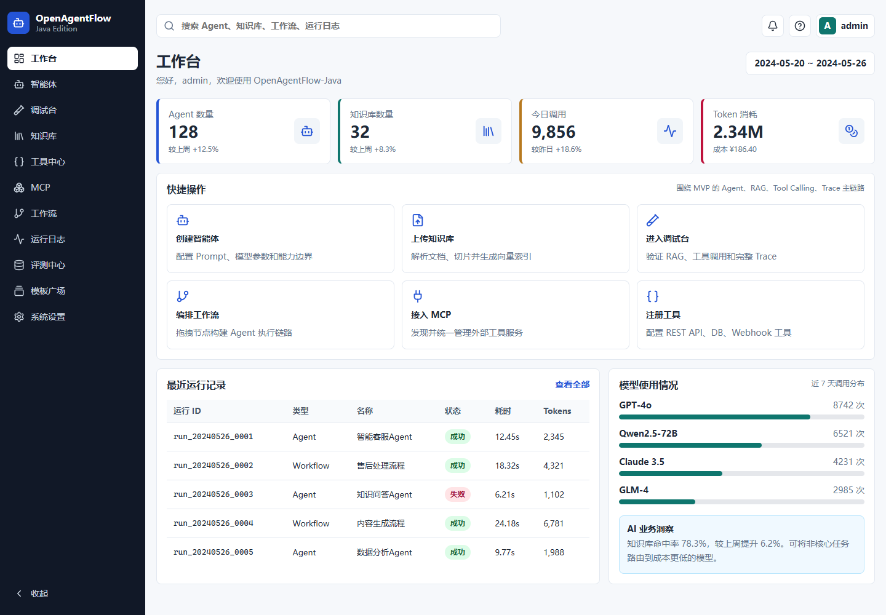
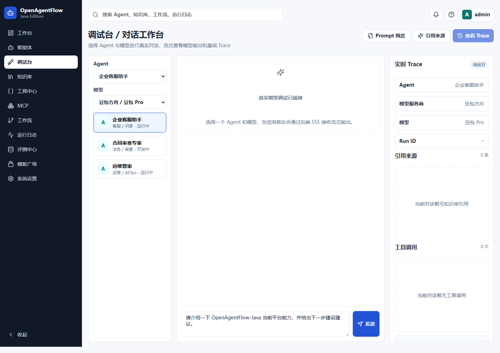
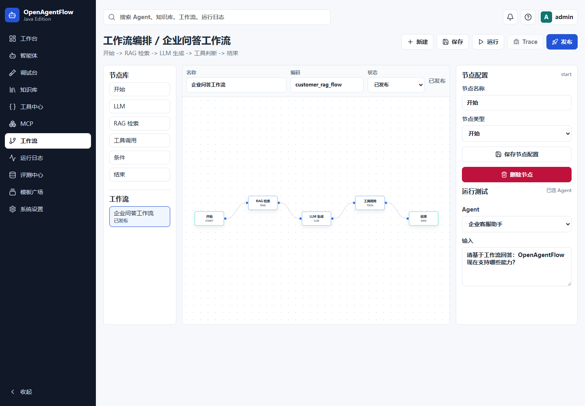

# OpenAgentFlow-Java

OpenAgentFlow-Java 是一个基于 **Java 21 + Spring Boot 3 + Vue 3** 的开源 AI Agent 工作流平台。项目面向企业知识库问答、工具调用、MCP 接入、工作流编排、运行 Trace 和模型评测场景，目标是提供一套可运行、可追踪、可评测、可扩展的 AI Agent 应用开发底座。

## 为什么核心链路自研

OpenAgentFlow-Java 的目标不是做一个简单的 AI 调用 Demo，而是完整呈现企业级 Agent 平台的核心链路。项目中的 Agent 编排、RAG 知识库、Tool Calling、MCP 接入、工作流执行、Trace 追踪、模型评测和成本治理均采用自研实现，方便开发者直接理解底层流程、学习关键设计并进行二次开发。

项目不会把能力绑定到某一个 AI 框架。模型、Embedding、向量库和工具调用都按开放适配思路设计，当前默认使用 OpenAI-compatible 接口、MySQL、Redis 和 Milvus；后续也可以按需扩展 Spring AI、LangChain4j 或其他模型网关。为企业落地留下可插拔的工程空间。

## 核心能力

- **模型接入**：OpenAI-compatible、豆包方舟、Ollama、DeepSeek、Qwen 等供应商配置，支持连通性测试、普通对话和 SSE 流式输出。
- **Agent 管理**：Agent CRUD、发布、复制、删除、模型参数、System Prompt、资源级权限和调试运行。
- **Prompt 模板中心**：System、User、RAG、Tool、Evaluation、Workflow Prompt 模板管理，支持变量解析、版本发布、复制、回滚和 Agent 绑定。
- **RAG 知识库**：知识库 CRUD、文档上传、解析、切片、Embedding、Milvus 写入、检索测试、引用来源和 Agent 绑定。
- **Tool Calling**：REST API、Webhook、数据库查询、MCP 工具，支持 Schema、连通性测试、风险等级、调用日志和 Trace。
- **可视化工作流**：Vue Flow 画布，支持开始、LLM、RAG、工具、条件、结束节点，支持发布、版本和执行 Trace。
- **MCP 接入**：MCP Server CRUD、HTTP JSON-RPC 连接测试、tools/prompts/resources 发现、同步到工具中心和 Agent/工作流调用。
- **运行观测 Trace**：统一记录 LLM、RAG、Tool、Workflow、Evaluation 步骤，展示 Token、耗时、错误和引用来源。
- **成本与用量中心**：按服务商、模型、Agent、用户、工作流、评测统计 Token、成本、耗时，支持明细导出、价格配置和配额拦截。
- **组织空间治理**：组织、工作空间、空间成员、资源归属和空间级访问控制，支持 Agent、知识库、工具、工作流按空间隔离。
- **运营监控告警**：统一展示平台健康、关键指标、告警规则、告警事件、通知渠道和一键巡检，支撑日常运营与交付验收。
- **模型评测 Evaluation**：评测集、样本导入、批量执行 Agent、规则评分、模型/Prompt/知识库策略对比和低分样本 Trace 追溯。
- **Agent 历史会话**：每个 Agent 支持按用户保存历史会话、消息列表、继续对话、新建会话和删除会话。
- **开源工程化**：Docker Compose、`.env.example`、CI、脚本、License、Issue/PR 模板和开源文档。

## 技术栈

| 层级 | 技术 |
| --- | --- |
| 前端 | Vue 3.5、TypeScript、Vite、Vue Router、Vue Flow、lucide-vue-next |
| 后端 | Java 21、Spring Boot 3.3、Spring Security、JWT、MyBatis-Plus |
| 数据 | MySQL 8、Redis 7、Milvus 2.4 |
| AI | OpenAI-compatible Chat、Embedding、Function Calling、MCP |
| 工程 | Docker Compose、GitHub Actions、PowerShell scripts |

## 界面预览







更多截图见 [演示流程](docs/演示流程.md)。

## 快速启动

### Docker Compose

```powershell
cd E:\xm\OpenAgentFlow-Java\dm
Copy-Item .env.example .env
docker compose up -d --build
```

访问地址：

- 前端：http://localhost:5173
- 后端：http://localhost:8080/api
- Swagger：http://localhost:8080/api/swagger-ui.html

默认账号：

```text
admin / 123456
```

### 本地开发

```powershell
cd E:\xm\OpenAgentFlow-Java\dm
.\scripts\start-dev.ps1
```

本地构建校验：

```powershell
.\scripts\build-all.ps1
```

停止本地服务：

```powershell
.\scripts\stop-dev.ps1
```

## 目录结构

```text
dm/
  .github/                    GitHub Actions、Issue 模板、PR 模板
  docs/                       架构、快速启动、配置、演示流程、路线图、界面截图
  docs/截图/                  登录页、工作台、智能体、调试台、工作流、运行日志截图
  scripts/                    本地开发和 Docker 启停脚本
  openagentflow-backend/      Spring Boot 后端
  openagentflow-frontend/     Vue 3 前端
  openagentflow-sql/          MySQL 初始化脚本
  docker-compose.yml          一键启动 MySQL、Redis、Milvus、后端、前端
  .env.example                示例环境变量
  LICENSE                     MIT License
```

## 文档

- [快速启动](docs/快速启动.md)
- [架构说明](docs/架构说明.md)
- [配置说明](docs/配置说明.md)
- [演示流程](docs/演示流程.md)
- [路线图](docs/路线图.md)
- [生产部署](docs/生产部署.md)
- [运营监控](docs/运营监控.md)
- [MySQL SQL 说明](openagentflow-sql/mysql/README.md)

## 配置约定

后端默认读取环境变量，未配置时使用本地开发默认值：

- MySQL：`openagentflow`，默认 `root/123456`
- Redis：`localhost:6379`
- Milvus：`localhost:19530`
- Milvus 开关：`OAF_MILVUS_ENABLED`，本地开发脚本会在 19530 未监听时自动设置为 `false`，后端使用 MySQL 向量兜底启动。
- 后端上下文路径：`/api`
- JWT Secret：生产环境必须通过 `OAF_JWT_SECRET` 覆盖

真实模型 API Key 不会写入源码、SQL 或 README。SQL 只初始化模型供应商和模型接入点，真实 Key 请在系统设置页或本地数据库中配置。

## SQL 初始化

MySQL 脚本目录：

```text
openagentflow-sql/mysql
```

执行顺序：

```text
V001__database_common.sql
V002__all_feature_tables.sql
V003__indexes_views_seed.sql
V004__milvus_integration.sql
V005__refresh_zh_comments.sql
V006__refresh_admin_password.sql
V007__seed_doubao_model_provider.sql
V008__agent_crud_permissions.sql
V009__rag_embedding_model_and_permissions.sql
V010__usage_cost_center.sql
V011__organization_workspace_governance.sql
V012__async_task_center.sql
V013__audit_risk_governance_center.sql
V014__model_gateway_governance.sql
V015__knowledge_governance_enhancement.sql
V016__ops_monitor_alert_center.sql
V017__prompt_template_center.sql
```

Docker Compose 首次初始化 MySQL 时会自动执行这些脚本。

## 当前版本状态

| 阶段 | 状态 | 说明 |
| --- | --- | --- |
| P0 登录、权限、模型接入 | 已完成 | JWT、Redis、模型供应商、SSE |
| P1 Agent 管理 | 已完成 | CRUD、发布、复制、删除、运行、Agent 权限 |
| P2 RAG 知识库 | 已完成 | 上传、解析、切片、Embedding、Milvus、引用来源 |
| P3 Tool Calling | 已完成 | REST API、Webhook、DB Query、工具日志 |
| P4 Trace 运行观测 | 已完成 | 运行列表、步骤详情、RAG/Tool/LLM 统一链路 |
| P5 工作流编排 | 已完成 | Vue Flow、节点执行、上下文变量、Trace |
| P6 MCP 工具接入 | 已完成 | Server 管理、发现、同步、调用、审计 |
| P7 模型评测 | 已完成 | 评测集、批量运行、指标、对比、Trace |
| P8 GitHub 开源发布准备 | 已完成 | Docker、CI、脚本、License、开源文档 |
| P9 Agent 历史会话 | 已完成 | 会话列表、消息持久化、继续对话、调试台历史面板 |
| P10 成本与用量中心 | 已完成 | 用量统计、成本明细、模型价格、配额拦截、日报、导出、Trace 跳转 |
| P11 组织/空间/资源治理 | 已完成 | 组织、工作空间、成员、资源归属、空间权限和前端管理页 |
| P12 异步任务中心 | 已完成 | 统一任务队列、进度、日志、取消、重试，知识库文档处理已接入 |
| P13 审计与风险治理中心 | 已完成 | 操作审计采集、风险事件归集、高风险确认审批、处置闭环 |
| P14 生产部署加固 | 已完成 | prod Profile、Secret 校验、安全头、生产 Compose、非 root 容器、部署文档 |
| P15 模型网关与模型治理 | 已完成 | 路由策略、候选模型、健康统计、失败回退、网关调用观测 |
| P16 知识库治理增强 | 已完成 | 治理策略、问题扫描、质量评分、风险级别、交付问题闭环 |
| P17 平台运营监控与告警中心 | 已完成 | 运营总览、健康矩阵、告警规则、告警事件、通知渠道、一键巡检 |
| P18 通知中心与消息触达 | 后置 | 已按优先级调整为低优先级，后续再做站内通知真实化和外部触达 |
| P19 Prompt 模板中心与版本治理 | 已完成 | Prompt 模板 CRUD、变量解析、版本发布、复制、回滚、Agent 绑定 |

## 演示建议

1. 登录 `admin / 123456`。
2. 在系统设置中配置真实模型 API Key。
3. 打开 Prompt 模板中心，创建或发布 System Prompt 模板，并在 Agent 详情页绑定。
4. 在调试台发起一次模型对话，并查看 Run ID。
5. 上传知识库文档，等待处理完成后做检索测试。
6. 绑定知识库到 Agent，在调试台查看引用来源。
7. 创建工具并绑定 Agent，触发 Tool Calling。
8. 打开运行日志，查看 LLM、RAG、Tool 的完整 Trace。
9. 创建工作流并运行，查看工作流 Trace。
10. 接入 MCP Server，发现并测试 MCP 工具。
11. 创建评测集、导入样本、运行评测并跳转低分样本 Trace。
12. 打开用量中心，查看模型成本趋势、调用明细、维度拆分和配额规则。
13. 打开组织空间，创建团队空间、添加成员，并确认 Agent、知识库、工具、工作流归属到空间。
14. 打开任务中心，查看知识库文档解析、切片、Embedding、Milvus 写入的实时进度和日志。
15. 打开风险治理，查看审计日志、高风险工具、MCP 风险、护栏事件和待确认请求，并完成处置记录。
16. 使用 `.env.prod` 和 `docker-compose.prod.yml` 验证生产部署配置，确认默认密钥不能启动生产后端。
17. 打开运营监控，点击立即巡检，查看 MySQL、Redis、Milvus、模型供应商、任务队列、API 质量和模型质量状态，并处理告警事件。

## 开源发布清单

- [x] 根级 `.gitignore`
- [x] `.env.example`
- [x] MIT `LICENSE`
- [x] Dockerfile 与 Docker Compose
- [x] GitHub Actions CI
- [x] Issue / PR 模板
- [x] 本地启动、停止、构建脚本
- [x] README 开源首页
- [x] 架构、配置、快速启动、演示、路线图文档
- [x] SQL 初始化说明
- [x] 中文界面截图

## P8 验证记录

- `docker compose config` 已通过，Compose 文件可正常解析。
- 后端已使用 JDK 21 和指定 Maven 本地仓库执行 `mvn -DskipTests compile`，结果通过。
- 前端已执行 `npm run build`，结果通过。
- 已补齐 GitHub Actions CI、Issue 模板、PR 模板、License、`.env.example`、Dockerfile、Docker Compose、开发脚本和中文 docs 文档。
- 已将开源文档文件名中文化：`快速启动.md`、`架构说明.md`、`配置说明.md`、`演示流程.md`、`路线图.md`。
- 已补充中文界面截图：`登录页.png`、`工作台.png`、`智能体管理.png`、`调试台.png`、`工作流编排.png`、`运行日志.png`。
- 已确认真实模型 API Key 不写入源码、SQL、README 或 docs；示例配置只保留占位 Secret 和本地开发默认值。

## 本地启动记录

- `scripts/start-dev.ps1` 会优先释放 8080 和 5173 端口，再启动后端与前端。
- 本地未检测到 Milvus `localhost:19530` 时，脚本会自动设置 `OAF_MILVUS_ENABLED=false`，后端正常启动并保留 MySQL 向量兜底；如需真实 Milvus 写入，请先启动 Milvus 后再运行脚本。

## P9 验证记录

- 已新增 Agent 历史会话接口：`/agents/{agentId}/sessions`、`/agents/{agentId}/sessions/{sessionId}/messages`。
- 已将 Agent 调试消息写入 `agent_session` 和 `agent_message`，并把 `session_id` 写入运行记录。
- 调试台已支持历史会话列表、新建会话、打开历史消息、删除会话和继续对话。
- 后端已使用 JDK 21 和指定 Maven 本地仓库执行 `mvn -DskipTests compile`，结果通过。
- 前端已执行 `npm run build`，结果通过。

## P10 验证记录

- 已新增后端成本接口：`/usage/console`、`/usage/overview`、`/usage/daily`、`/usage/breakdown`、`/usage/calls`、`/usage/calls/export`、`/usage/quotas`。
- 已将模型输入/输出每千 Token 单价接入系统设置页和模型配置接口，真实成本按 `model_config.input_price_per_1k`、`model_config.output_price_per_1k` 计算。
- 已将聊天、Agent 运行和工作流 LLM 节点接入调用前配额预估拦截，支持全局、用户、角色、Agent、服务商、模型配额，调用后写入 `runtime_llm_call`、`runtime_trace_step.cost_amount`、`runtime_run.total_cost`、`runtime_cost_daily` 和 `model_usage_quota` 已用值。
- 已新增前端“用量中心”页面，支持总览卡片、成本趋势、模型/Agent/用户/工作流/评测维度拆分、调用明细、CSV 导出、配额新增/编辑/删除和 Trace 跳转。
- 已新增“重算历史成本”能力：先在系统设置中填写模型输入/输出每千 Token 单价，再在用量中心点击“重算历史成本”，即可把已有 Token 的历史调用成本回填到调用明细、Trace、运行总成本、成本日报和配额已用值。
- 如果用量中心显示有 Token 但成本为 0，表示对应模型的 `input_price_per_1k` 和 `output_price_per_1k` 仍为 0；这不是模型调用失败，而是尚未配置计费单价。
- 已新增 SQL 迁移 `V010__usage_cost_center.sql`，包含用量中心权限、统计索引和示例全局日配额。
- 后端已使用 JDK 21 和指定 Maven 本地仓库执行 `mvn "-Dmaven.repo.local=D:\kfhj\maven\mavenopenagent" -DskipTests compile`，结果通过。
- 前端已执行 `npm run build`，结果通过。

## P11 验证记录

- 已新增 SQL 迁移 `V011__organization_workspace_governance.sql`，创建 `oaf_organization`、`oaf_organization_member`、`oaf_workspace`、`oaf_workspace_member`、`oaf_workspace_resource` 表，并为 Agent、知识库、工具、工作流、MCP Server 增加 `workspace_id` 字段。
- 已初始化默认组织和默认工作空间，已有 Agent、知识库、工具、工作流、MCP Server 会自动归属到默认工作空间。
- 已新增组织/工作空间接口：`/organizations`、`/workspaces`、`/workspaces/{id}`、`/workspaces/{id}/members`。
- 已将 Agent、知识库、工具、工作流接入空间归属和空间成员权限判断，保留原有所有者、ACL 和全局管理员权限。
- 已新增前端“组织空间”页面，支持组织列表、工作空间列表、空间创建/编辑、成员添加/移除和空间资源统计。
- 后端已使用 JDK 21 和指定 Maven 本地仓库执行 `mvn "-Dmaven.repo.local=D:\kfhj\maven\mavenopenagent" -DskipTests compile`，结果通过。
- 前端已执行 `npm run build`，结果通过。

## P12 验证记录

- 已新增 SQL 迁移 `V012__async_task_center.sql`，创建 `async_task` 和 `async_task_log`，每张表和每个字段均包含中文注释。
- 已新增异步任务中心后端接口：`/tasks/overview`、`/tasks`、`/tasks/{id}`、`/tasks/{id}/cancel`、`/tasks/{id}/retry`。
- 已新增平台异步任务线程池 `oafAsyncTaskExecutor`，避免耗时任务占用 Web 请求线程。
- 已将知识库文档上传处理接入任务中心，解析、切片、Embedding、MySQL 保存、Milvus 写入、失败原因都会写入统一任务进度和日志。
- 已新增前端“任务中心”页面，支持任务统计、筛选、列表、详情、日志、取消和重试；知识库详情页可跳转查看任务中心日志。
- 后端已使用 JDK 21 和指定 Maven 本地仓库执行 `mvn "-Dmaven.repo.local=D:\kfhj\maven\mavenopenagent" -DskipTests compile`，结果通过。
- 前端已执行 `npm run build`，结果通过。

## P13 验证记录

- 已新增 SQL 迁移 `V013__audit_risk_governance_center.sql`，创建 `risk_governance_event` 风险治理事件表，并补充审计、工具调用、护栏和确认请求索引。
- 已新增操作审计过滤器，业务接口访问会自动写入 `audit_operation_log`，记录用户、路径、方法、状态码、耗时、IP 和失败原因。
- 已新增审计与风险治理接口：`/governance/overview`、`/governance/audits`、`/governance/risks`、`/governance/confirmations`、`/governance/risks/{id}/handle`、`/governance/confirmations/{id}/approve`、`/governance/confirmations/{id}/reject`。
- 已将高风险工具、MCP 高风险能力、高风险确认请求、失败或高风险工具调用、运行时护栏事件归集为统一风险事件，支持处置状态和备注。
- 已新增前端“风险治理”页面，支持概览指标、风险事件筛选、处置、风险证据查看、高风险确认审批和操作审计检索。
- 后端已使用 JDK 21 和指定 Maven 本地仓库执行 `mvn "-Dmaven.repo.local=D:\kfhj\maven\mavenopenagent" -DskipTests compile`，结果通过。
- 前端已执行 `npm run build`，结果通过。

## P14 验证记录

- 已新增后端生产配置 `application-prod.yml`，收敛 Actuator 详情、默认关闭 Swagger、启用 readiness/liveness、支持生产 CORS 域名配置和连接池参数。
- 已新增生产启动校验 `ProductionStartupValidator`，在 `prod` Profile 下禁止默认 JWT Secret、弱 Secret、localhost CORS 和默认 MySQL 密码启动。
- 已为后端接口补充安全响应头，并将 CORS 来源改为 `OAF_CORS_ALLOWED_ORIGINS` 配置。
- 已加固 Docker 镜像：后端非 root 用户运行，前端使用非特权 Nginx，Nginx 增加安全响应头、gzip、静态缓存和 SSE 代理参数。
- 已新增 `docker-compose.prod.yml`、`.env.prod.example`、`scripts/prod-up.ps1`、`scripts/prod-down.ps1` 和中文文档 `docs/生产部署.md`。
- 生产 Compose 默认只暴露前端网关端口，MySQL、Redis、Milvus、MinIO、etcd 不直接映射到宿主机。
- 已执行 `docker compose --env-file .env.prod.example -f docker-compose.prod.yml config`，生产 Compose 配置可正常解析。
- 后端已使用 JDK 21 和指定 Maven 本地仓库执行 `mvn "-Dmaven.repo.local=D:\kfhj\maven\mavenopenagent" -DskipTests compile`，结果通过。
- 前端已执行 `npm run build`，结果通过。

## 维护约定

- 新增或修改 Java 类、方法、字段和主要业务逻辑时补充中文注释。
- 每次修改前端、后端、SQL、项目结构、依赖、配置、启动方式或关键功能时，同步更新 README 或 docs。
- 前端页面已按原型图搭建，后续优先保持既有页面结构和视觉，不随意重做页面。
- 不要把真实模型 API Key 写入源码、SQL、README、docs 或提交记录。

## P15 验证记录

- 已新增 SQL 迁移 `V014__model_gateway_governance.sql`，为 `runtime_llm_call` 补充 `route_policy_id`、`gateway_scene_type`、`route_decision`、`fallback_used` 字段，并为新增字段和相关路由表字段补充中文注释。
- 已初始化默认模型路由策略 `default-agent-chat`，场景为 `AGENT_CHAT`，并把当前启用的 Chat 模型写入候选模型列表。
- 已新增后端模型网关能力：`/model-gateway/overview`、`/model-gateway/policies`、`/model-gateway/health`、`/model-gateway/calls`，支持路由策略 CRUD、候选模型治理、健康统计、最近调用与回退可观测。
- 已将 Agent 调试对话和工作流 LLM 节点接入模型网关：显式选择模型或 Agent 已绑定模型时保持直连；未指定模型时按场景策略选择候选模型；失败时按策略自动回退到下一个候选模型。
- 已将模型网关决策写入 LLM 调用日志，Trace 和成本用量中心可继续按实际调用模型统计 Token、成本、耗时和成功失败状态。
- 已新增前端“模型网关”页面，支持策略列表、策略表单、候选模型、模型健康、最近网关调用和 24 小时失败率/回退次数查看。
- 已同步恢复左侧导航中文标签，并新增“模型网关”入口。
- 已修复 `scripts/start-dev.ps1` 中旧注释与命令粘连导致端口释放可能失效的问题，后续本地启动会先释放 8080/5173 再拉起新进程。
- 已在本地 MySQL 成功应用 `V014__model_gateway_governance.sql`，验证新增 4 个网关字段、默认策略和候选模型均已存在。
- 后端已使用 JDK 21 和指定 Maven 本地仓库执行 `mvn "-Dmaven.repo.local=D:\kfhj\maven\mavenopenagent" -DskipTests compile`，结果通过。
- 前端已执行 `npm run build`，结果通过。

## P16 验证记录

- 已新增 SQL 迁移 `V015__knowledge_governance_enhancement.sql`，创建 `knowledge_governance_policy` 和 `knowledge_governance_issue`，每张表和每个字段均包含中文注释，并初始化默认知识库治理策略。
- 已新增后端知识库治理能力：`/knowledge-governance/overview`、`/knowledge-governance/quality`、`/knowledge-governance/scan`、`/knowledge-governance/issues`、`/knowledge-governance/policies`。
- 治理扫描已覆盖解析失败、处理中卡住、长期未更新、缺少向量、Milvus同步异常、切片Token异常、未绑定智能体、空知识库等交付风险。
- 治理扫描会遵守策略中的 `autoIssueEnabled` 开关；指定知识库关闭自动生成问题后，扫描不会再为该知识库创建新的打开问题。
- 已新增前端“知识治理”页面，支持治理概览、问题扫描、问题处理、治理策略 CRUD、知识库质量评分和风险级别查看。
- 已新增中文文档 `docs/知识库治理.md`，用于说明 P16 的能力范围、接口、前端入口和本地验证方式。
- 已恢复左侧导航中文显示，并新增“知识治理”入口 `/knowledge-governance`。
- 已在本地 MySQL `openagentflow` 成功应用 `V015__knowledge_governance_enhancement.sql`，本次扫描生成 12 个打开的治理问题。
- 后端已使用 JDK 21 和指定 Maven 本地仓库执行 `mvn "-Dmaven.repo.local=D:\kfhj\maven\mavenopenagent" -DskipTests compile`，结果通过。
- 前端已执行 `npm run build`，结果通过。
- 本地服务已启动：后端 `http://localhost:8080/api`，前端 `http://localhost:5173`；登录态验证知识治理概览、扫描、问题列表、质量列表、策略列表均成功。
- 已修复知识治理页面中治理问题列表和质量列表在窄屏或列内容较多时撑出页面的问题：表格改为容器内横向滚动，长 JSON/ID 文本允许断行，知识治理双栏布局在 `1180px` 以下自动折成单栏。已用 Playwright 在 `1366px` 和 `1024px` 宽度验证页面级横向溢出为 `false`。

## 全局列表分页更新记录

- 已新增前端通用分页能力：`components/PaginationBar.vue` 和 `composables/usePagination.ts`，所有前端列表统一按每页 10 条展示，并提供上一页、下一页、总数和当前范围提示。
- 已接入分页的主要页面包括：工作台最近运行记录、智能体列表/详情绑定列表、知识库列表/详情列表、知识治理问题/策略/质量列表、工具中心、MCP Server/MCP 工具/能力列表、工作流列表、运行记录与 Trace 步骤、模型网关、评测集/评测结果、组织空间、异步任务中心、审计风险治理中心、用量中心、运营监控、系统设置、模板广场。
- 调试台为高频操作页面，左侧智能体、历史会话和右侧引用来源、工具调用不使用分页，改为固定高度列表框并在内容超出时使用内部滚动条。
- 已将服务端分页默认值统一为 10 条：运行记录、用量调用明细、风险治理事件、审计日志、异步任务中心在未显式传入 `pageSize` 时都会默认返回 10 条。
- 本次已执行前端 `npm run build`，结果通过；已使用 JDK 21 和指定 Maven 本地仓库执行后端 `mvn "-Dmaven.repo.local=D:\kfhj\maven\mavenopenagent" -DskipTests compile`，结果通过。

## 菜单栏修复记录

- 已修复左侧菜单项增多后菜单栏超出页面的问题：侧边栏保持固定高度，品牌区和收起按钮固定，菜单列表独立纵向滚动。
- 已为菜单文字增加单行省略和横向溢出保护，避免中文菜单项或后续新增菜单撑宽侧边栏。
- 已保持移动端窄侧栏样式不变，窄屏下仍只展示图标。
- 本次已执行前端 `npm run build`，结果通过。

## 调试台布局修复记录

- 已取消调试台左侧智能体列表、历史会话列表、右侧引用来源列表、工具调用列表的分页展示。
- 左侧智能体和历史会话已拆分为两个固定高度列表框，内容超出时各自使用内部滚动条。
- 右侧 Trace 面板已改为固定网格布局：基础 Trace 信息固定，引用来源列表和工具调用列表分别拥有独立滚动条，不再使用右侧整体滚动条。
- 已将左侧调试面板改为固定网格布局：顶部 Agent/模型选择器固定，智能体列表和历史会话列表分别拥有独立滚动条，不再使用左侧整体滚动条。
- 本次已执行前端 `npm run build`，结果通过。

## 知识治理页面布局更新记录

- 已将知识治理页面的“治理问题列表”“治理策略列表”“知识库质量列表”改为三个卡片式切换入口，每次只展示当前选中的列表区域。
- 已移除治理策略的页面内联新增/编辑表单，改为在“治理策略列表”卡片中通过右上角“新增治理策略”按钮打开弹窗。
- 治理策略编辑也复用同一个弹窗，列表本身保留分页、编辑和删除操作。
- 本次已执行前端 `npm run build`，结果通过。

## 用量中心页面布局更新记录

- 已将用量中心页面的“成本趋势”“维度拆分”“调用成本明细”“配额规则”改为四个卡片式切换入口，每次只展示当前选中的业务区域。
- 已移除配额规则的页面内联新增/编辑表单，改为在“配额规则”卡片中通过右上角“新增配额”按钮打开弹窗。
- 配额编辑也复用同一个弹窗，配额规则列表本身保留分页、编辑和删除操作。
- 本次已执行前端 `npm run build`，结果通过。

## 运营监控页面布局更新记录

- 已将运营监控顶部“打开告警”“异常组件”“任务积压”“今日成本”改为和智能体列表统计卡一致的横排样式。
- 已将“平台健康矩阵”“告警事件”“告警处理”“告警规则”“巡检项”“通知渠道”改为六个卡片式切换入口，每次只展示当前选中的业务区域。
- 已移除告警规则的页面内联新建/编辑表单，改为在“告警规则”卡片中通过右上角“新建告警规则”按钮打开弹窗。
- 告警规则编辑也复用同一个弹窗，告警规则列表本身保留分页、筛选、编辑和删除操作。
- 本次已执行前端 `npm run build`，结果通过。

## 模型网关页面布局更新记录

- 已将模型网关页面的“路由策略”“模型健康”“最近网关调用”改为三个卡片式切换入口，每次只展示当前选中的业务区域。
- 已移除路由策略的页面内联新增/编辑表单，改为在“路由策略”卡片中通过右上角“新增策略”按钮打开弹窗。
- 路由策略编辑也复用同一个弹窗，路由策略列表本身保留分页、编辑和删除操作。
- 本次已执行前端 `npm run build`，结果通过。

## 组织空间页面布局更新记录

- 已将组织空间页面顶部“组织数”“工作空间”“空间成员”“纳管资源”改为和智能体列表统计卡一致的横排样式。
- 已将“组织列表”“工作空间”“成员与角色”改为三个卡片式切换入口，每次只展示当前选中的业务区域。
- 已移除工作空间的页面内联新增/编辑表单，改为在“工作空间”卡片中通过右上角“新增工作空间”按钮打开弹窗。
- 工作空间编辑也复用同一个弹窗，工作空间列表本身保留分页、选择和编辑操作。
- 已将组织列表中的新增组织从页面内联表单改为右上角“新增组织”按钮触发弹窗。
- 已将成员与角色中的新增成员与角色从页面内联表单改为右上角“新增成员与角色”按钮触发弹窗。
- 本次已执行前端 `npm run build`，结果通过。

## 运营类页面统一布局更新记录

- 已将任务中心页面顶部统计改为横排统计卡，任务队列保留为主列表视图。
- 已将风险治理页面顶部统计改为横排统计卡，并将“风险事件”“高风险确认”“操作审计”改为卡片式切换入口。
- 已将风险治理页面的风险详情从卡片切换改为弹框展示，点击风险行或详情按钮即可查看和处置风险。
- 已将评测集管理页面改为横排统计卡，并将“评测集”“样本导入”“运行评测”“最近评测任务”改为卡片式切换入口；新建/编辑评测集改为弹窗。
- 已将评测结果页面的“模型策略对比”“样本结果”“低分样本详情”改为卡片式切换入口。
- 已将系统设置页面的“用户与角色权限”“模型供应商配置”“模型列表”改为卡片式切换入口；新增/编辑模型供应商改为弹窗。
- 已将任务中心页面的任务详情从卡片切换改为弹框展示，点击任务行或详情按钮即可查看完整执行信息。
- 本次已执行前端 `npm run build`，结果通过。

## P17 验证记录

- 已新增 SQL 迁移 `V016__ops_monitor_alert_center.sql`，创建 `ops_alert_rule`、`ops_alert_event`、`ops_health_check`、`ops_notify_channel` 四张表，所有表和字段均包含中文注释。
- 已初始化默认站内通知渠道、默认 Webhook 渠道占位、7 个巡检项和 5 条默认告警规则，并为管理员角色写入 `ops:monitor:view`、`ops:monitor:manage` 权限。
- 已新增后端运营监控接口：`/ops-monitor/overview`、`/ops-monitor/health`、`/ops-monitor/inspect`、`/ops-monitor/rules`、`/ops-monitor/events`、`/ops-monitor/checks`、`/ops-monitor/channels`。
- 已接入健康巡检：MySQL、Redis、Milvus、模型供应商、异步任务队列、API 质量、模型调用质量。
- 已接入告警规则评估：支持 API 失败率、API 平均耗时、模型失败率、模型平均耗时、任务积压、任务失败、未处理风险、知识治理问题、今日成本等指标。
- 已将告警触发接入站内通知，默认分发给 `super_admin` 和 `admin` 用户。
- 已新增前端“运营监控”页面和左侧导航入口 `/ops`，支持总览卡片、健康矩阵、告警事件处理、告警规则 CRUD、巡检项、通知渠道查看，所有列表每页 10 条。
- 已新增中文文档 `docs/运营监控.md`，用于说明 P17 的能力范围、接口、数据表、前端入口和本地验证方式。
- 已在本地 MySQL `openagentflow` 成功应用 `V016__ops_monitor_alert_center.sql`。
- 后端已使用 JDK 21 和指定 Maven 本地仓库执行 `mvn "-Dmaven.repo.local=D:\kfhj\maven\mavenopenagent" -DskipTests compile`，结果通过。
- 前端已执行 `npm run build`，结果通过。
- 本地服务已启动：后端 `http://localhost:8080/api`，前端 `http://localhost:5173`；已验证登录、运营监控总览、手动巡检、告警规则分页、告警事件分页接口成功，浏览器快照确认 `/ops` 页面正常渲染。

## P19 验证记录

- 已按新的优先级安排将 P18 通知中心真实化后置，优先完成 P19 Prompt 模板中心与版本治理。
- 已新增 SQL 迁移 `V017__prompt_template_center.sql`，刷新 `prompt_template` 和 `prompt_template_version` 中文表字段注释，新增 `prompt:manage` 权限，并初始化默认 Prompt 模板版本。
- 已新增后端 Prompt 模板中心接口：`/prompt-templates/overview`、`/prompt-templates`、`/prompt-templates/{id}`、`/prompt-templates/{id}/publish`、`/prompt-templates/{id}/copy`、`/prompt-templates/{id}/versions/{versionId}/rollback`。
- 已新增后端 Prompt 模板服务，支持模板 CRUD、变量 JSON 校验、从 `{{变量名}}` 自动解析变量、版本发布、版本复制和回滚。
- 已新增前端“Prompt 模板中心”页面和左侧导航入口 `/prompts`，支持模板筛选、分页、编辑弹窗、变量预览、版本发布、复制和回滚。
- 已在 Agent 详情页新增 System Prompt 模板选择，读取已发布 System Prompt 模板并自动带入模板内容，保存时写入 `systemPromptTemplateId`。
- 已修复 Agent 新建/编辑页顶部 Tab 只高亮但不切换内容的问题；现在“基础信息”“模型参数”“Prompt 配置”“知识库绑定”“工具绑定”“工作流绑定”“安全策略”都会切换到对应配置面板。
- 已修复 Agent 新建/编辑页“知识库绑定”“工具绑定”“工作流绑定”列表仍沿用三列布局导致宽度和长度异常的问题，改为单列全宽列表并设置固定高度内部滚动。
- 已将智能体列表页“新建智能体”从跳转详情页改为弹框创建，并保留原新建页全部卡片切换：基础信息、模型参数、Prompt 配置、知识库绑定、工具绑定、工作流绑定、安全策略；创建时同步保存知识库、工具和工作流绑定关系。
- 已修正新建智能体弹框“安全策略”卡片的状态短文案，避免出现单字“草”，统一显示为“启用 / 未发布”。
- 已在本地 MySQL `openagentflow` 成功应用 `V017__prompt_template_center.sql`。
- 前端已执行 `npm run build`，结果通过。
- 后端已使用 JDK 21 和指定 Maven 本地仓库执行 `mvn "-Dmaven.repo.local=D:\kfhj\maven\mavenopenagent" -DskipTests compile`，结果通过；如直接运行 Maven，请先设置 `JAVA_HOME=D:\kfhj\jdk\jdk-21.0.11`，避免系统默认 Java 8 导致编译失败。

## IAM 用户与权限中心更新记录

- 已新增 SQL 迁移 `V018__iam_admin_center.sql`，初始化 `iam:manage` 权限，并默认授权给 `super_admin` 和 `admin` 角色。
- 已在本地 MySQL `openagentflow` 成功应用 `V018__iam_admin_center.sql`，验证 `iam:manage` 权限记录数量为 1。
- 已新增后端 IAM 管理接口：`/iam-admin/overview`、`/iam-admin/users`、`/iam-admin/departments`、`/iam-admin/roles`、`/iam-admin/roles/{id}/permissions`、`/iam-admin/permissions`。
- 已新增后端 IAM 管理服务，支持用户 CRUD、用户软删除、BCrypt 密码保存、用户所属部门设置、系统角色分配、部门树 CRUD、角色 CRUD 和角色权限批量配置。
- 已将系统设置页从静态用户 mock 改为真实接口，保留原“模型供应商配置”和“模型列表”卡片，并新增“用户管理”“部门树”“角色权限”卡片切换。
- 已在前端新增用户弹框、部门弹框和角色权限弹框；用户弹框可设置所属部门和系统角色，角色弹框可勾选菜单/API 权限。
- 后端已使用 JDK 21 和指定 Maven 本地仓库执行 `mvn "-Dmaven.repo.local=D:\kfhj\maven\mavenopenagent" -DskipTests compile`，结果通过。
- 前端已执行 `npm run build`，结果通过。
## 登录退出更新记录

- 已在前端顶栏新增退出登录按钮，点击后调用后端 `/auth/logout`，由后端删除 Redis 中的 token 状态。
- 已新增前端 `logout()` API 封装，退出时会清理 `oaf_access_token` 和 `oaf_current_user`，即使 token 已过期或网络异常也会回到登录页。
- 顶栏用户信息已从本地当前用户缓存读取，不再固定显示 `admin`。
- 本次已执行前端 `npm run build`，结果通过；后端退出接口已存在，本次未修改后端代码且未启动后端。
## 默认演示账号修复记录

- 已确认原始种子数据只初始化了 `admin` 登录账号，`developer` 和 `user` 仅存在于 `iam_role` 角色表中，因此此前不能直接用 `user / 123456` 登录。
- 已新增 SQL 迁移 `V019__seed_default_login_users.sql`，初始化 `developer / 123456` 和 `user / 123456` 两个演示登录账号，并分别绑定 `developer`、`user` 系统角色。
- 已在本地 MySQL `openagentflow` 成功写入并校验：`admin`、`developer`、`user` 三个账号的密码 `123456` 均可通过 BCrypt 匹配。
## 菜单权限过滤更新记录

- 已新增前端权限工具 `src/api/permissions.ts`，统一维护菜单与权限编码的映射关系。
- 左侧菜单已改为按当前登录用户 `currentUser.permissions` 动态过滤；`super_admin` 和 `admin` 角色默认显示全部菜单。
- 登录成功后不再固定跳转 `/dashboard`，会跳转到当前用户第一个有权限的菜单，避免普通用户进入无权限页面。
- 前端路由守卫已接入菜单权限判断，用户直接访问无权限菜单路径时会自动跳转到第一个可访问菜单。
- 本次已执行前端 `npm run build`，结果通过；未修改后端代码且未启动后端。
## 菜单栏自适应高度更新记录

- 已调整左侧菜单栏布局：菜单项较少时不再强制把“收起”按钮顶到底部，侧边栏内容会按实际菜单高度自然排列。
- 菜单项较多时仍保留菜单列表内部滚动，避免整页被长菜单撑出视口。
- 本次已执行前端 `npm run build`，结果通过；未修改后端代码且未启动后端。
## 列表密度与长字段展示更新记录

- 已为所有包含分页组件的标准列表卡片增加统一视口高度限制：当列表内容超过页面可用高度时，列表卡片内部出现纵向滚动条，分页条固定在卡片底部，表头在滚动时保持吸顶。
- 已为模板广场、工作流侧栏列表、弹窗绑定列表等非标准表格分页场景补充内部滚动规则，避免长列表继续撑高页面。
- 已新增前端全局长字段悬浮查看能力：表格单元格、列表行标题/说明、编码类字段默认单行省略，鼠标移动到被截断或较长文本上时展示完整内容浮层。
- 已将顶部汇总数据卡片高度压缩约一半，并同步压缩卡片切换入口、快捷卡片、模板卡片、供应商卡片、列表行和筛选区间距，让下方业务列表获得更多可视空间。
- 本次已执行前端 `npm run build`，结果通过；未修改后端代码，未自动启动或重启后端。

## 指标卡片方块化更新记录

- 已将各页面顶部汇总指标卡从横向铺满的大卡片改为固定小宽度的近方形卡片，桌面端不再四等分撑满整行，视觉上更像紧凑数据块。
- 指标卡片现在使用自动填充布局，宽屏横向排列，空间不足时自动换行；数值、标题和说明保持单行省略，避免把卡片撑宽或撑高。
- 本次已执行前端 `npm run build`，结果通过；未修改后端代码，未自动启动或重启后端。

## 指标卡片横向自适应更新记录

- 已按最新要求恢复各页面顶部汇总指标卡横向自适应铺满整行，卡片按当前数量平均分配宽度，不再自动换行。
- 保留紧凑高度、单行省略和图标右上角布局，保证下方列表区域仍能获得更多可视空间。
- 本次已执行前端 `npm run build`，结果通过；未修改后端代码，未自动启动或重启后端。

## License

[MIT](LICENSE)
