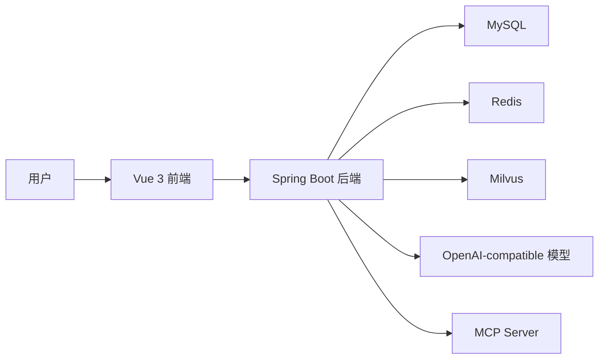

# 架构说明

OpenAgentFlow-Java 采用前后端分离架构：Vue 负责管理界面、调试台、工作流画布和结果展示；Spring Boot 负责权限、Agent 编排、RAG 检索、工具调用、MCP 连接、Trace 和评测任务。

## 后端模块

- 用户、角色、权限、JWT 登录和 Redis Token 状态。
- 模型供应商、模型配置、OpenAI-compatible 聊天和 SSE 流式输出。
- Agent 创建、编辑、发布、复制、删除、运行和资源级权限。
- RAG 知识库、文档解析、切片、Embedding、Milvus 同步、检索和引用来源。
- REST API、Webhook、数据库查询、MCP 工具调用。
- 可视化工作流定义、发布、运行和节点 Trace。
- 运行 Trace，记录 LLM、RAG、Tool、Workflow、Evaluation 的完整链路。
- 模型评测，包含评测集、样本、批量运行、指标、报告和模型对比。

## 数据存储

- MySQL：业务数据、配置、权限、日志、Trace、评测和审计记录。
- Redis：验证码答案、JWT Token 状态和后续缓存能力。
- Milvus：RAG 高维向量检索。

## Trace 链路

每次 Agent 或工作流运行会写入：

- `runtime_run`
- `runtime_trace_step`
- `runtime_llm_call`
- `knowledge_retrieval_log`
- `tool_invocation_log`

评测运行会在 `eval_task_run.run_id` 中保留运行 ID，因此每条低分样本都可以跳转到完整 Trace。
