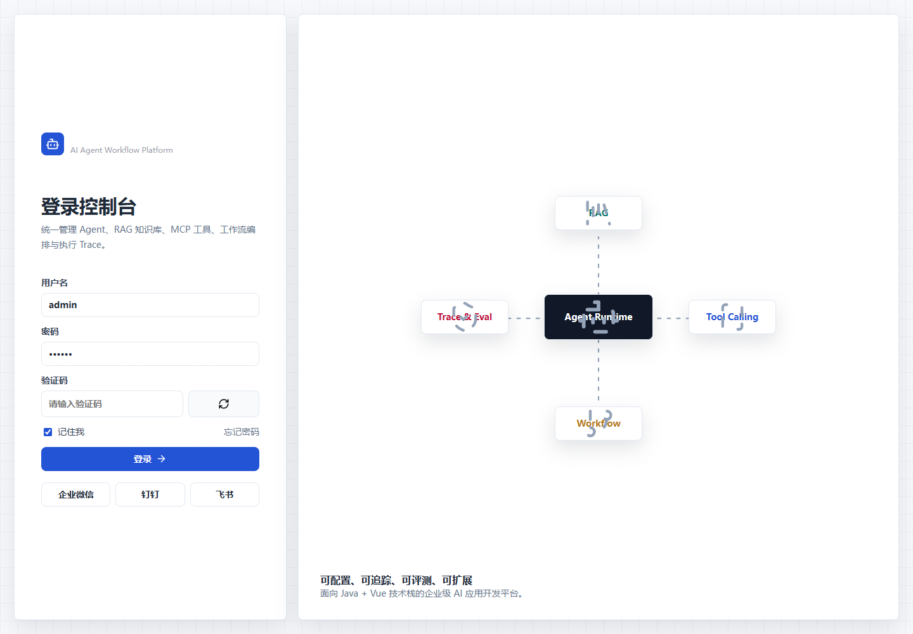
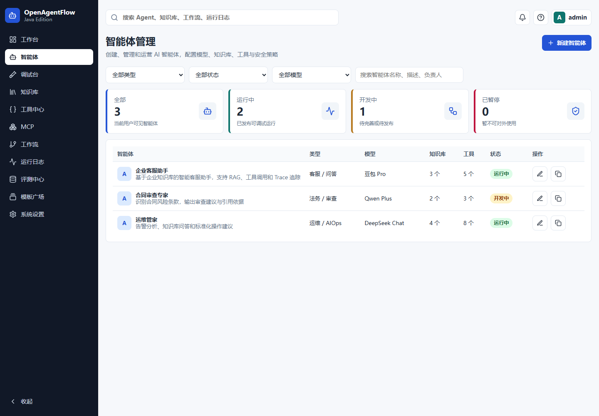
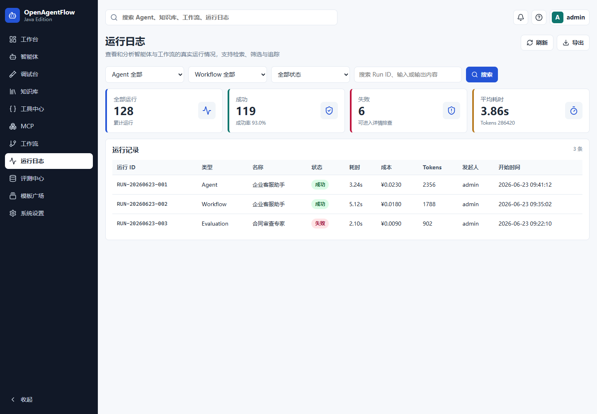

# 演示流程

按照下面流程可以验证一套完整的 OpenAgentFlow-Java 能力。

## 界面截图

## 推荐流程

1. 使用 `admin / 123456` 登录。
2. 打开系统设置，配置真实模型 API Key。
3. 打开调试台，发送一条简单消息，确认模型对话可用。
4. 打开知识库，创建知识库并上传文档，等待解析、切片、Embedding 和 Milvus 写入完成。
5. 将知识库绑定到 Agent。
6. 回到调试台提问，检查回答中的引用来源。
7. 打开工具中心，创建 REST API 或 Webhook 工具，并执行连通性测试。
8. 将工具绑定到 Agent，触发一次 Tool Calling。
9. 打开运行日志，查看完整 Trace。
10. 打开工作流设计器，创建一个简单工作流，发布并运行。
11. 打开 MCP 页面，连接 HTTP JSON-RPC MCP Server，发现并测试 MCP 工具。
12. 打开评测中心，导入一条样本，运行评测，并从样本结果跳转到 Trace。

## 注意事项

- SQL 可能包含豆包方舟接入点 ID，但不会保存真实 API Key。
- 如果 Milvus 暂不可用，可以先验证 MySQL 中的知识库元数据和低容量向量兜底能力。
- 当前评测模块使用规则评分 MVP，后续可以扩展为 LLM-as-Judge。
